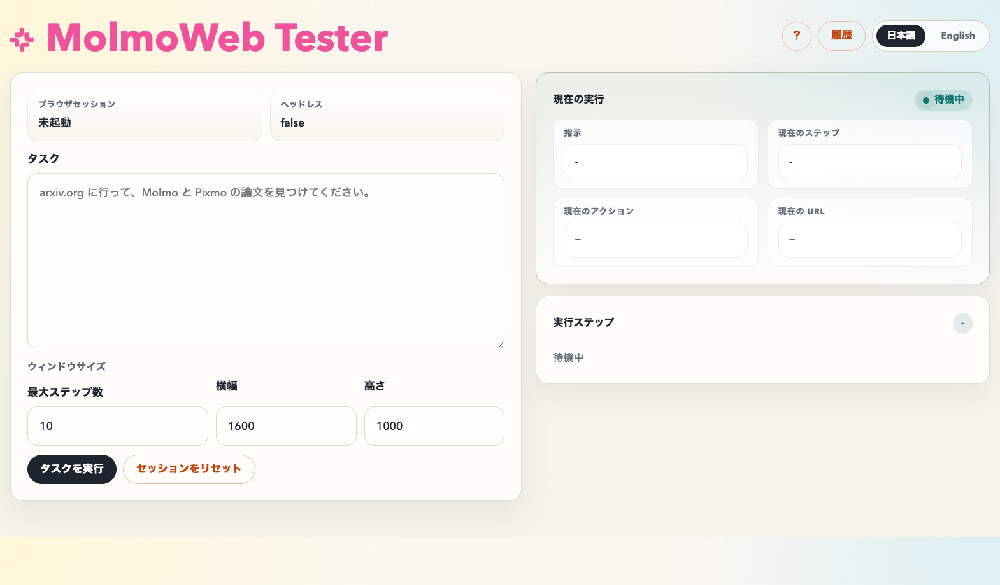

<p align="center">
  
</p>

<p align="center">
  A local testing GUI for MolmoWeb on macOS
</p>

<p align="center">
  <a href="docs/README.en.md">English Guide</a> &nbsp;|&nbsp;
  <a href="docs/README.ja.md">日本語ガイド</a> &nbsp;|&nbsp;
  <a href="https://github.com/allenai/molmoweb">Upstream MolmoWeb</a>
</p>

---

**MolmoWeb Tester** is a local control panel for [MolmoWeb](https://github.com/allenai/molmoweb). It adds a browser-based GUI on top of the model server so you can send tasks, watch the current run, inspect execution steps, and review history from your own machine.

This repository is currently focused on **macOS**, especially **Apple Silicon Macs**. The model server has been adjusted to prefer `mps` and fall back to CPU when needed.

## Preview

<p align="center">
  
</p>

## Highlights

- Local GUI for testing MolmoWeb from the browser
- Live run panel with current action, URL, and step progress
- Execution step viewer with per-step screenshots
- Persistent run history with delete / clear actions
- Japanese / English language switcher
- Adjustable Chromium window size
- macOS-friendly model server fallback: `cuda -> mps -> cpu`

## Quick Start

```bash
cd molmoweb
uv sync
uv run playwright install chromium

export PREDICTOR_TYPE=hf
bash scripts/start_server.sh ./checkpoints/MolmoWeb-8B
```

In another terminal:

```bash
cd molmoweb
bash scripts/start_gui.sh 8010
```

Open:

```text
http://127.0.0.1:8010/?lang=ja
```

## Documentation

- [English Guide](docs/README.en.md)
- [日本語ガイド](docs/README.ja.md)

## Current Scope

- OS: macOS
- Recommended hardware: Apple Silicon Mac
- Browser control: Playwright-managed Chromium
- Tested model: `MolmoWeb-8B`

## Notes

- This GUI controls a separate Chromium window. It does not take over your existing Safari or Brave session.
- Some advanced interactions, especially right-click and tab workflows, still have room for improvement.
- Local history is stored under `inference/htmls/gui/`.

## Acknowledgements

This project is based on [allenai/molmoweb](https://github.com/allenai/molmoweb), with additional work for macOS compatibility and a local tester GUI.
